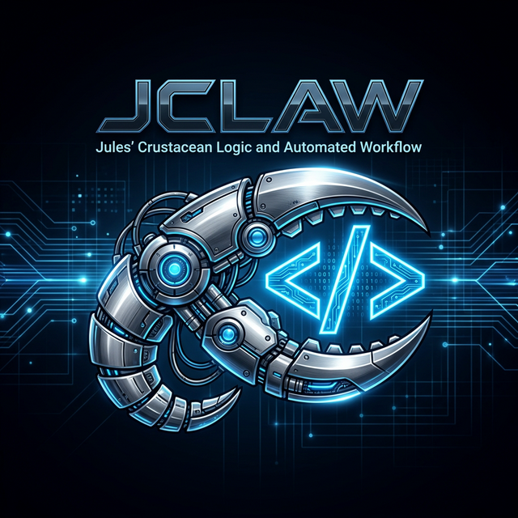

# 🤖 AI Agent Setup Guide: JCLAW (Jules Crustacean Logic & Automated Workflow)



This guide is designed for an AI agent (like Antigravity, Claude, or Cursor) to quickly install, configure, and utilize this MCP server in a new environment.

## 🚀 Fast-Track Installation (CLI)

Run these commands to clone, build, and prepare the server:

```bash
# 1. Clone the repository
git clone https://github.com/mcelb1200/JCLAW.git
cd JCLAW

# 2. Install dependencies
npm install

# 3. Build the project
npm run build

# 4. Verify local Jules CLI (Optional but Recommended)
jules --version
```

## ⚙️ Configuration (Environment Variables)

This server uses a **Tiered Interaction Model**. It prefers the CLI and REST API over browser automation. To enable this, configure the following:

| Variable | Required | Description |
|----------|----------|-------------|
| `JULES_API_KEY` | **Highly Recommended** | Your Jules Personal Access Token (PAT). Enables 10x faster task ops via REST API. |
| `JULES_CLI_PATH` | Optional | Path to the `jules` binary. Defaults to `jules` in PATH. |
| `SESSION_MODE` | Optional | Use `cookies` or `browserbase` for browser fallbacks. |
| `GOOGLE_AUTH_COOKIES`| Optional | Required for browser-based fallbacks if API/CLI fail. |

## 🛠️ Adding to MCP Config

Add this entry to your `mcpConfig` (e.g., `claude_desktop_config.json` or `.cursor/mcp.json`):

```json
{
  "mcpServers": {
    "JCLAW": {
      "command": "node",
      "args": ["/absolute/path/to/JCLAW/dist/index.js"],
      "env": {
        "JULES_API_KEY": "your_api_key_here",
        "JULES_CLI_PATH": "jules",
        "SESSION_MODE": "cookies",
        "GOOGLE_AUTH_COOKIES": "..."
      }
    }
  }
}
```

## 🧠 Core Agent Workflow: The "Lobster" Pattern

This MCP is designed to support the **Lobster Pattern** (inspired by the Molty agent):
- **Brain (The Agent):** Antigravity/Claude provides high-level reasoning, context, and instruction.
- **Muscles (Jules):** The autonomous execution engine performs multi-file refactors in a remote VM.

### 1. Standard Orchestration Structure
Before using `jules_delegate_task`, ensure the following directory structure exists in your repository root:

```text
.jules/
├── backlog/   # Pending instruction files (e.g. feature-A.md)
├── active/    # Currently executing instructions
├── audit/     # Recorded audit reports ([sessionID].jclaw.md)
└── logs/      # Local execution logs
```

### 2. Tiered Instruction Discovery
The `jules_delegate_task` tool uses a **Tiered Logic** to find Jules' instructions:
1. **Explicit `instruction`**: Raw text provided directly to the tool.
2. **Explicit `instructionFile`**: Path to a specific Markdown file.
3. **TaskID Lookup**: If a `taskId` (e.g., `performance-fix`) is provided, it searches:
   - `.jules/active/performance-fix.md`
   - `.jules/backlog/performance-fix.md` (Moves to `active/` on successful delegation)
4. **Branch Fallback**: Searches `.jules/active/[branch-name].md`.
5. **Marker Fallback**: Scans for `@jules` markers in the codebase.

### 3. Orchestration Lifecycle
1. **Prepare**: Create a named contract in `.jules/backlog/[task-id].md`.
2. **Delegate**: Call `jules_delegate_task` with the `taskId`.
3. **Monitor**: Periodically check `jules_check_feedback`.
4. **Audit**: Once complete, run `jules_audit_report`. The report is automatically saved to `.jules/audit/`.
5. **Synthesis**: Review the Jules PR and merge using the recorded audit for traceability.
6. **Conclude**: Run `jules_conclude_task`. It automatically archives instructions and can re-issue remaining work to the `.jules/backlog/` if the session was `incomplete`.

## 🔍 Monitoring & Salvaging

- **`jules_conclude_task`**: Finalizes the session.
  - `completed`: Moves instruction to `.jules/archive/`.
  - `incomplete`: Archives as `.incomplete.md` and generates a new `.jules/backlog/` task for residual work.
- **`jules_check_feedback`**: Run this periodically to see if Jules is blocked in `AWAITING_USER_FEEDBACK`. It retrieves the exact question from Jules.
- **`jules_analyze_code`**: Use `returnPatch: true` to salvage a unified Git patch from any session (even failed ones).
- **`jules_audit_report`**: Generates a consolidated Markdown audit report (.jclaw.md) including intent, activity logs, code outcomes, and most recent code review reasoning.
- **`jules_code_review`**: Specifically extracts the last code review/merge assessment from Jules sessions for quick auditing.
- **`jules_list_tasks`**: Filters by the current repository automatically across all branches.

## ⚠️ Important Note
- Ensure `jules` is authenticated on the host machine (`jules login`) if using CLI mode.
- REST API is the most reliable tier for initiating complex prompts.
